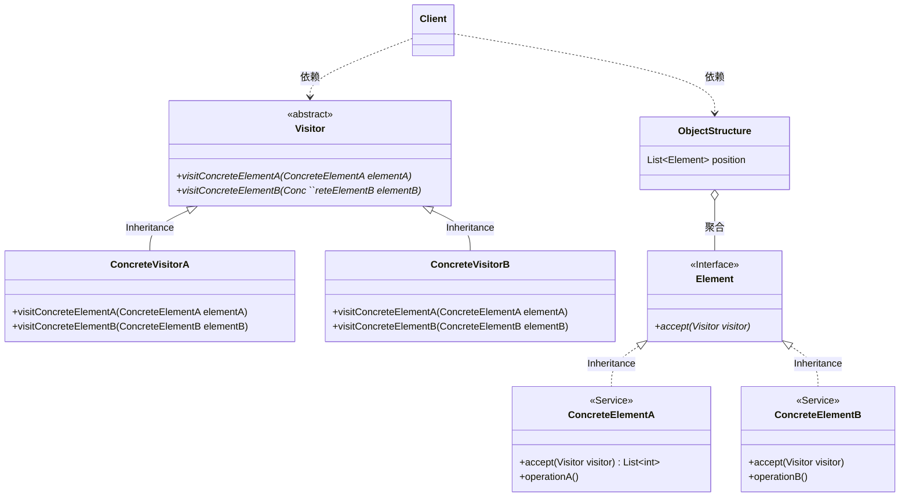

# 访问者模式

```mermaid
classDiagram
	class Visitor{
	<<abstract>>
		+visitConcreteElementA (ConcreteElementA elementA )*
		+visitConcreteElementB(Conc            ``reteElementB elementB)*
	}
	class ConcreteVisitorA{
		+visitConcreteElementA(ConcreteElementA elementA)
		+visitConcreteElementB(ConcreteElementB elementB)
	}
	class ConcreteVisitorB{
		+visitConcreteElementA(ConcreteElementA elementA)
		+visitConcreteElementB(ConcreteElementB elementB)
	}
	class Element{
		<<Interface>>
		+accept(Visitor visitor)*
	}
	class ConcreteElementA{
	<<Service>>
		+accept(Visitor visitor) List~int~
		+operationA()
	}
	class ConcreteElementB{
	<<Service>>
		+accept(Visitor visitor)
		+operationB()
	}
	class Client{
		
	}
	class ObjectStructure{
		List~Element~ position
	}
	Visitor <|-- ConcreteVisitorA :Inheritance
	Visitor <|-- ConcreteVisitorB:Inheritance
	Element <|.. ConcreteElementA:Inheritance
	Element <|.. ConcreteElementB:Inheritance
	Client  ..> Visitor:依赖
	Client ..> ObjectStructure:依赖
	ObjectStructure o-- Element:聚合
	
	
	
	
```

